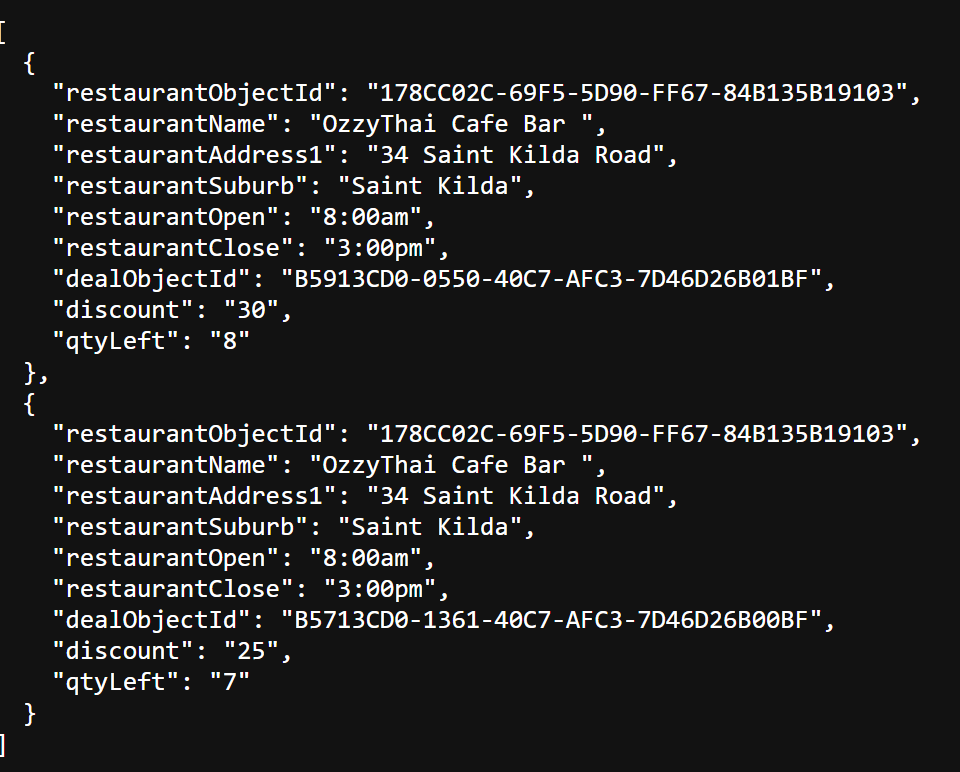
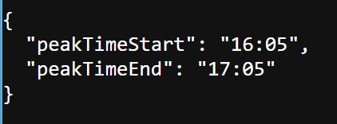

# Restaurant Deals Service
A service to manage restaurant deals.

## Overview
This service provides REST APIs to manage restaurant deals based on time.

## APIs
1. GET /active?timeOfDay - Deals active at specified time. 
Sample -
   http://localhost:8080/api/restaurant/deals/active?timeOfDay=10:00
   Response (200 OK)

2. GET /peak-time - Peak time window during which most deals are active. 
Sample -
   http://localhost:8080/api/restaurant/deals/peak-time
   Response (200 OK)

## External API
https://eccdn.com.au/misc/challengedata.json

## Tech Stack
- Java 25
- Spring Boot 4.x
- Maven

## Running the application locally
1. Import the project to your favorite IDE.
2. To start application: Run as Spring Boot App.

## Assumptions
- Active Deals API -
- Both 24 Hour and 12 Hour format accepted as timeOfDay for API.

A deal’s open and close time are resolved in the following priority:
- open / close fields
- start / end fields
- Restaurant default opening hours
- If none of the above are provided, the deal is assumed as Inactive.

- Peak window deals API -
- In case, multiple windows with same maximum deals, first window slot is returned.

